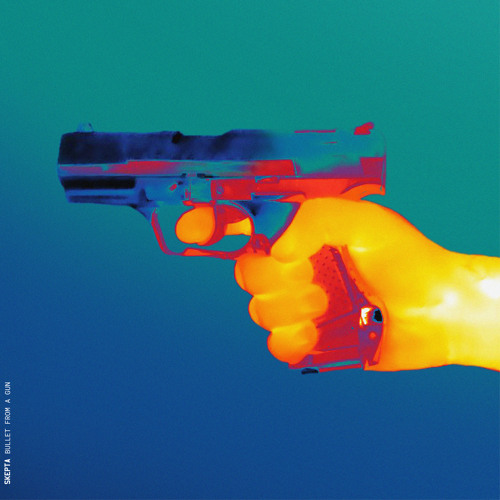

<div align="center">



<a href="https://universe.roboflow.com/bulletfromagun/bullets-holes-and-other-things">
    </img>
</a>

</div>

<br/>

# Gunshot Detection in Targets: A Object Detection Benchmark

This repository is dedicated to the comparison and benchmarking of state-of-the-art Convolutional Neural Networks (CNNs) for the purpose of detecting gunshot holes in targets. As an emerging area of interest within the fields of computer vision and object detection, the accurate identification of gunshot impacts on various targets presents unique challenges and applications, ranging from sports shooting analysis to law enforcement training enhancements.


## Objective
Our primary goal is to systematically evaluate and identify the most effective CNN models for gunshot hole detection, considering aspects such as accuracy, speed, and computational efficiency. Through rigorous testing across different datasets, including varying target materials, bullet calibers, and shooting distances, we aim to provide comprehensive insights that can guide researchers, hobbyists, and professionals in selecting or developing optimized models for similar applications.

# Software and Hardware
This project was developed on a 64-bit *Ubuntu Linux 22.04* operating system, equipped with 16 GB of RAM and an 8-core *AMD Ryzen 7 3700X* processor. The graphics processing unit used was a *NVIDIA GeForce GTX 1660 Ti*. All codes were implemented and executed using the *Python* programming language, version 3.10.12. Most of the Deep Learning models were developed using the *PyTorch* library version 2.0.0+cu117.

## Methodology
`todo`

### Data Preparation
The dataset used in this project consists of images of targets with gunshot holes, captured under mainly two different conditions: in with the target is composed by concentric circles (reffered as "circle" in the current work) and the other with the target is composed by concentric rounded-corner like squares (reffered as "vertical" in the current work).

The first step in the data preparation process was to annotate the gunshot holes in the images. This was done using the [Supervisely](https://supervise.ly/) platform, which allows for the creation of custom object detection datasets. The annotated dataset was then exported in both formats, YOLOv5 and COCO, to facilitate the training of different CNN models.

Images were cropped in bulks of 50 images using the web tool [Bulk Image Crop](https://bulkimagecrop.com/), by uploading them in the tool and setting the target aspect ratio to 1:1. Then all images were previewed and the ones that were not cropped correctly were manually cropped using the same tool.

# Development Notes

## Experimentation
As a [Kedro](https://kedro.org/) project, this repository is structured in a modular and reproducible way. A tl;dr manner to execute an experiment is to run the following command:

```sh
kedro run --to-nodes=detectron2.rccn_101_conf1_v1.evaluate_detectron2
```

This command will execute the following steps, under the hood:

### 1. Choose an Experiment
The file `/conf/base/parameters.yml` contains the configuration for the experiments. As an example:

```yaml
detectron2:
    rccn_101_conf1_v1:
        dataprep_params:
            experiment_id: "detectron2_rccn_101_conf1_v1"
            coco_data:
                path:
                    - data
                    - 05_model_input
                    - gunshots
                    - coco
                    - v1
                datasets:
                    - train
                    - valid
                    - test
        fine_tuning_params:
            path:
                - data
                - 06_models
                - output
            pretrained_model_config: COCO-Detection/faster_rcnn_R_101_FPN_3x.yaml
            num_workers: 2
            pretrained_model_weights: COCO-Detection/faster_rcnn_R_101_FPN_3x.yaml
            ims_per_batch: 2
            base_lr: 0.00125
            max_iter: 256
            steps: []
            batch_size_per_image: 512
            num_classes: 2
            score_thresh_test: 0.5
```

Here, `detectron2` is the object detection framework, `rccn_101_conf1_v1` is the experiment ID, in which
* `rcnn_101` identifies the model
* `conf1` is the configuration version
* `v1` is the dataset version

The `dataprep_params` section contains the parameters for the dataset preparation, and the `fine_tuning_params` section contains the parameters for the model fine-tuning.

### 2. Run the Experiment
To run the experiment, execute the following command:

```sh
kedro run -n detectron2.rccn_101_conf1_v1.fine_tune_detectron2
```

The data, generally at the `data/05_model_input` folder, will be prepared and the model will be fine-tuned. The results will be saved at the `data/06_models/output/experiment_id` folder.

### 3. Evaluate the Experiment

There is the option to visualize the results of the experiment via tensorboard:

```sh
tensorboard --logdir="data/06_models/output/detectron2_rccn_101_conf1_v1"
```

or to evaluate the model using the `detectron2` evaluation script:

```sh
kedro run -n detectron2.rccn_101_conf1_v1.fine_tune_detectron2
```

The evaluation results will be saved at the `data/06_models/output/experiment_id/evaluation` and `data/07_model_output/experiment_id` folders.

## Notes on Object Detection Models

- Region Proposal Methods
    - Selective Search
    - Edge Boxes
    - Region Proposal Networks (RPN)
    - Superpixels

---

- Dataset Preparation
- Neural Network Architecture Selection
  - Propósal (Two-Stage)
    - RCNN
    - Fast RCNN
    - Faster RCNN
    - Mask RCNN
    - RFCN
  - Proposal-Free (One-Stage)
    - YOLO
    - SSD
- Model Training
- Inference
- Evaluation
- Results

YOLO vs RCNN
- YOLO is faster than RCNN
- RCNN is more accurate than YOLO
- YOLO is better for real-time applications

## Notes on Object Detection Metrics

+ IoU, intersection over union, area of overlap divided by area of union
+ AP, average precision: varying different thresholds for the IoU
+ AP50, average precision at 50% IoU
+ AP75, average precision at 75% IoU, it is more strict
+ APs, APm, APl, average precision for small, medium, large objects

In recent years, the most frequently used evaluation for detection is "Average Precision (AP)", which was originally introduced in VOC2007. AP is defined as the average detection precision under different recalls and is usually evaluated in a category-specific manner. The mean AP (mAP) averaged over all categories is typically used as the final metric of performance. To measure object localization accuracy, the Intersection over Union (IoU) between the predicted box and the ground truth is used to verify whether it is greater than a predefined threshold, such as 0.5. If it is, the object is identified as "detected"; otherwise, it is considered "missed". The 0.5-IoU mAP has then become the de facto metric for object detection​(nodes)​.

Citing/reference: `arXiv:1905.05055v3 [cs.CV] 18 Jan 2023`

# References
- [https://arxiv.org/abs/1807.05511](https://arxiv.org/abs/1807.05511)
- [https://www.sciencedirect.com/science/article/abs/pii/S1051200422004298](https://www.sciencedirect.com/science/article/abs/pii/S1051200422004298)
- [Object Detection in 20 Years: A Survey](https://arxiv.org/abs/1905.05055)

# License
This project is licensed under the MIT License - see the LICENSE file for details.