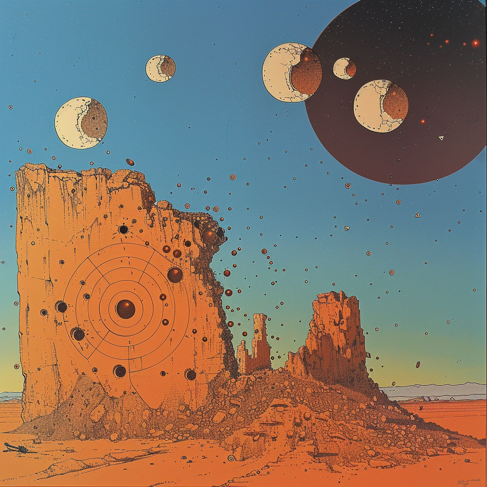
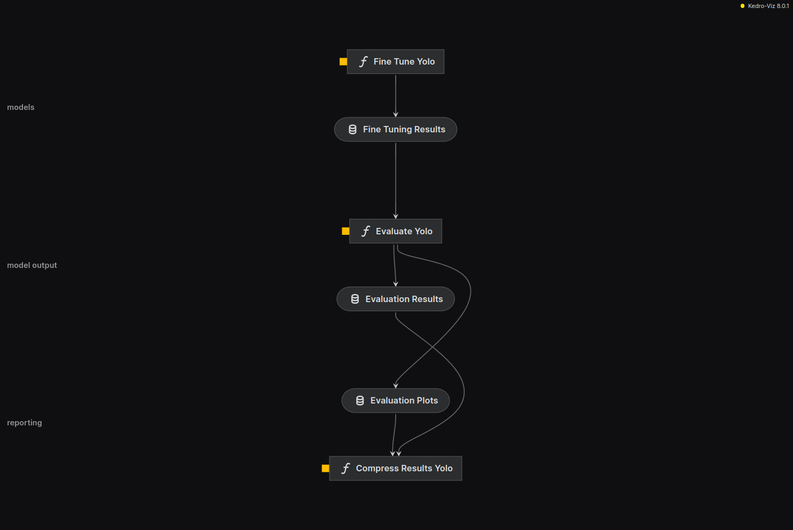

# Gunshot Detection in Targets: An Object Detection Benchmark

This repository is dedicated to comparing and benchmarking state-of-the-art Convolutional Neural Networks (CNNs) for detecting gunshot holes in various surfaces and materials. Although many algorithms were implemented, only YOLOv8 was selected for further experiments.

<div align="center">



<a href="https://app.roboflow.com/bulletfromagun/bullet-holes-other-things/overview">
    </img>
</a>

</div>


## Objective
Our primary goal is to systematically evaluate and identify the most effective CNN models for gunshot hole detection, considering aspects such as accuracy, speed, and computational efficiency.

## Software and Hardware
This project was developed on a 64-bit *Ubuntu Linux 22.04* operating system, equipped with 16 GB of RAM and an 8-core *AMD Ryzen 7 3700X* processor. The graphics processing unit used was a *NVIDIA GeForce GTX 1660 Ti*. All code was implemented and executed using the *Python* programming language, version 3.10.12. Most of the deep learning models were developed using the *PyTorch* library, version 2.0.0+cu117.

The training for the yolo branch was performed using *g4dn.2xlarge* instances on the *Deep Learning OSS Nvidia Driver AMI GPU PyTorch 2.3.0 (Amazon Linux 2) 20240716 AMI*. These instances are equipped with 32 GB of RAM and feature an *NVIDIA T4 Tensor Core GPU*. All code was implemented and executed using the Python programming language, version 3.10.12. The YOLO models were developed using the PyTorch library, version 2.3.0+cu117.

## Methodology
In this section the steps taken to prepare data, train models, and evaluate the results are described.

### Data Preparation
The dataset used in this project consists of images with the presence or absence of gunshot holes, mostly sourced from YouTube videos.

The first step in the data preparation process was to annotate the gunshot holes in the images. This was done using the [Roboflow](https://roboflow.com/) platform, which allows for the creation of custom object detection datasets. During this process, it was necessary to remove some images due to the following reasons:

* Bullet holes were not visible because the destruction from gunshots was too severe.
* Removing brand names, logos, or human faces caused the image to lose visible bullet holes.
* Presence of grass, as many images were taken from a video of a shooting club, and the grass would introduce bias in the model.

Additionally, it was necessary to standardize images to generalize the dataset for a broader range of algorithms and architecture possibilities. Therefore, images were cropped in batches of 50 using the web tool [Bulk Image Crop](https://bulkimagecrop.com/), by uploading them to the tool and setting the target aspect ratio to 1:1. Then, all images were previewed, and those not cropped correctly were manually cropped using the same tool.

After this, the images were grouped into a project at Roboflow, which in this case is published as [Bullet Holes & Other Things Project](https://app.roboflow.com/bulletfromagun/bullet-holes-other-things/overview). The annotated dataset was then exported in both YOLOv8 and COCO formats to facilitate the training of different algorithms.

### Modeling
Although the focus is on YOLOv8, all implemented algorithms share the following structure:

<div align="center">



</div>

#### `Fine Tune` node
Here, data from Roboflow is used as input to fine-tune the model. This node encapsulates all data adjustments needed to train the model. Both the model state and the parameters and hyperparameters used in fine-tuning are saved at the end of this node's execution in the `Fine Tuning Results` object.

#### `Evaluate` node
In this node, the model is evaluated using train, validation, and test datasets. Once the evaluation is done, some random predictions are made and saved as image files. Lastly, a confusion matrix is generated and saved as both a JSON file and an image file. The results are saved in the `Evaluation Results` and `Evaluation Plots` objects.

#### `Compress Results` node
This node is responsible for compressing the results of the evaluation, excluding the model weights, and saving them in a zip file.


## Usage

As a [Kedro](https://kedro.org/) project, this repository is structured in a modular and reproducible way. A _tl;dr_ manner to execute an experiment is to run the following command:

```sh
kedro run --to-nodes=detectron2.rccn_101_conf1_v1.evaluate_detectron2
```

This command will execute the following steps, under the hood:

### 1. Choose an Experiment
The file `/conf/base/parameters.yml` contains the configuration for the experiments. As an example:

```yaml
detectron2:
    rccn_101_conf1_v1:
        dataprep_params:
            experiment_id: "detectron2_rccn_101_conf1_v1"
            coco_data:
                path:
                    - data
                    - 05_model_input
                    - gunshots
                    - coco
                    - v1
                datasets:
                    - train
                    - valid
                    - test
        fine_tuning_params:
            path:
                - data
                - 06_models
                - output
            pretrained_model_config: COCO-Detection/faster_rcnn_R_101_FPN_3x.yaml
            num_workers: 2
            pretrained_model_weights: COCO-Detection/faster_rcnn_R_101_FPN_3x.yaml
            ims_per_batch: 2
            base_lr: 0.00125
            max_iter: 256
            steps: []
            batch_size_per_image: 512
            num_classes: 2
            score_thresh_test: 0.5
```

Here, `detectron2` is the object detection framework, `rccn_101_conf1_v1` is the experiment ID, in which
* `rcnn_101` identifies the model
* `conf1` is the configuration version
* `v1` is the dataset version

The `dataprep_params` section contains the parameters for the dataset preparation, and the `fine_tuning_params` section contains the parameters for the model fine-tuning.

### 2. Run the Experiment
To run the experiment, execute the following command:

```sh
kedro run -n detectron2.rccn_101_conf1_v1.fine_tune_detectron2
```

The data, generally at the `data/05_model_input` folder, will be prepared and the model will be fine-tuned. The results will be saved at the `data/06_models/output/experiment_id` folder.

### 3. Evaluate the Experiment

There is the option to visualize the results of the experiment via tensorboard:

```sh
tensorboard --logdir="data/06_models/output/detectron2_rccn_101_conf1_v1"
```

or to evaluate the model using the `detectron2` evaluation script:

```sh
kedro run -n detectron2.rccn_101_conf1_v1.fine_tune_detectron2
```

The evaluation results will be saved at the `data/06_models/output/experiment_id/evaluation` and `data/07_model_output/experiment_id` folders.
